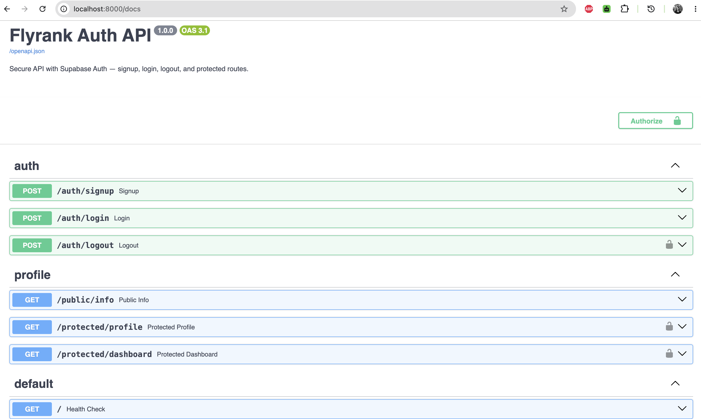

# Supabase Auth API

A secure backend API built with **FastAPI** and **Supabase Auth**.

The API handles user sign up, log in, and log out, issues and verifies JSON Web Tokens (JWTs) via Supabase, and guards protected routes using a reusable authentication dependency (middleware). Interactive API docs are available through Swagger UI with full Bearer-token authorization support.

## What this project does

- Lets users **create an account** and **log in** through Supabase Auth (Supabase handles password hashing and token signing — this project never touches raw passwords or crypto).
- Issues a short-lived **access token** and a **refresh token** on login.
- **Verifies** that access token on every request to a protected route, by asking Supabase directly whether it's valid.
- Uses a single reusable **auth guard** (a FastAPI dependency) to protect multiple routes without duplicating logic.
- Documents every route in **Swagger UI**, with a padlock on protected endpoints so they can be tested directly from the browser.

## Tech stack

| Layer | Tool |
|---|---|
| Language / Framework | Python 3.10+, FastAPI |
| Identity Provider | Supabase Auth |
| Server | Uvicorn |
| Docs | Swagger UI (auto-generated at `/docs`) |

## Prerequisites

- Python 3.10 or newer
- [uv](https://docs.astral.sh/uv/) for environment and dependency management
- A Supabase project
- `curl` for the command-line examples
- `jq` for extracting the access token in the curl login example

## Project structure

```
app/
├── main.py            # App entrypoint — mounts all routers
├── config.py           # Loads .env, creates the shared Supabase client
├── schemas.py           # Request body validation (Pydantic models)
├── dependencies.py       # Reusable auth guard (verifies bearer tokens)
└── routers/
    ├── auth.py           # /auth/signup, /auth/login, /auth/logout
    └── profile.py         # /public/info, /protected/profile, /protected/dashboard
```

## Setup

### 1. Clone and create a virtual environment

```bash
git clone https://github.com/Anujakhatri/auth-login-supabase-.git
cd auth-login-supabase-
uv venv .venv
source .venv/bin/activate      # Windows: .venv\Scripts\activate
```

### 2. Install dependencies

```bash
uv pip install -r requirements.txt
```

### 3. Create a Supabase project

1. Sign up at [supabase.com](https://supabase.com) (free, no credit card) and create a new project.
2. Go to **Project Settings → API** and copy your **Project URL** and **anon (public) key**. Never use the `service_role` key here.
3. Go to **Authentication → Sign In / Providers → Email**. For local practice, turn **"Confirm email" OFF**; otherwise, users must verify their email before logging in.

### 4. Configure environment variables

Copy the example file and fill in your own Supabase credentials:

```bash
cp .env.example .env
```

`.env` should look like:

```
SUPABASE_URL=https://your-project-ref.supabase.co
SUPABASE_KEY=your_anon_key
PORT=8000
```

Never commit `.env` or expose the `SUPABASE_KEY` value. This project expects the public `anon` key, not the privileged `service_role` key.
## Run the server

```bash
uvicorn app.main:app --reload --port 8000
```

The server starts at `http://localhost:8000`. Interactive docs are available at:

```
http://localhost:8000/docs
```

The root endpoint can be used as a simple health check:

```bash
curl http://localhost:8000/
```

## API Reference

| Method | Route | Purpose | Auth required | Success status |
|---|---|---|---|---|
| GET | `/` | Check that the API is running | No | `200 OK` |
| POST | `/auth/signup` | Create a new user account | No | `201 Created` |
| POST | `/auth/login` | Authenticate and return an access + refresh token | No | `200 OK` |
| POST | `/auth/logout` | End the current session | Yes — `Authorization: Bearer <token>` | `204 No Content` |
| GET | `/public/info` | Read public, open data | No | `200 OK` |
| GET | `/protected/profile` | Read the logged-in user's own profile data | Yes — `Authorization: Bearer <token>` | `200 OK` |
| GET | `/protected/dashboard` | Example second protected route, reusing the same guard | Yes — `Authorization: Bearer <token>` | `200 OK` |

### Request bodies

Signup and login both accept the following JSON body:

```json
{
  "email": "your_email@gmail.com",
  "password": "yourpassword123"
}
```

### Status codes used

| Code | Meaning | When it happens |
|---|---|---|
| `200` | OK | Successful login, or a successful read from a protected/public route |
| `201` | Created | Successful signup |
| `204` | No Content | Successful logout |
| `400` | Bad Request | Supabase rejects signup input (e.g. invalid email, weak password) |
| `401` | Unauthorized | Missing, malformed, invalid, or expired token — or wrong login credentials |

## Testing it yourself

### Via curl

```bash
# 1. Sign up
curl -i -X POST http://localhost:8000/auth/signup \
  -H "Content-Type: application/json" \
  -d '{"email":"your_email@gmail.com","password":"yourpassword123"}'

# 2. Log in and grab the access token (requires jq)
TOKEN=$(curl -s -X POST http://localhost:8000/auth/login \
  -H "Content-Type: application/json" \
  -d '{"email":"your_email@gmail.com","password":"yourpassword123"}' | jq -r '.access_token')

# 3. Call a protected route
curl -i http://localhost:8000/protected/profile \
  -H "Authorization: Bearer $TOKEN"

# 4. Tamper with the token — should return 401
curl -i http://localhost:8000/protected/profile \
  -H "Authorization: Bearer ${TOKEN}tampered"

# 5. Log out
curl -i -X POST http://localhost:8000/auth/logout \
  -H "Authorization: Bearer $TOKEN"
```

### Via Swagger UI

1. Open `http://localhost:8000/docs`.
2. Click **Authorize** (top right), paste your access token (no `Bearer` prefix needed), and confirm.
3. Expand any route with a lock icon (`/protected/profile`, `/protected/dashboard`, `/auth/logout`) and click **Try it out → Execute**.

The signup response contains the created user. The login response contains `access_token` and `refresh_token`; use only the `access_token` as the bearer token for protected API requests.

**Swagger screenshot:**




## How the auth flow works

1. **Client → Supabase**: the client sends an email + password to `/auth/signup` or `/auth/login`.
2. **Supabase → Client**: Supabase validates the credentials, hashes/checks the password, and signs a JWT (access token) and refresh token.
3. **Client → this server**: the client attaches the access token to protected requests as `Authorization: Bearer <token>`.
4. **This server → Supabase**: the `get_current_user` dependency asks Supabase to verify the token on every protected request. If Supabase confirms it's valid, the route runs; otherwise the request is rejected with `401` before any route logic executes.

This server never stores passwords, never hashes anything, and never signs a token — Supabase is the trusted Identity Provider for all of that.

## 401 vs 403

- `401 Unauthorized` — "I don't know who you are." Used here for missing, malformed, invalid, or expired tokens, and for failed login credentials.
- `403 Forbidden` — "I know exactly who you are, and you still may not." Not yet implemented in this version (see Stretch goals).

## Notes / known limitations

- Logging out clears the Supabase client session, but the access token itself remains technically valid until it expires (JWTs are stateless) — this is a well-known limitation of pure JWT-based auth, not a bug in this implementation.
- Rate limiting on Supabase's free tier can occasionally cause `"email rate limit exceeded"` errors on signup during heavy testing; this is a Supabase project limit, not an application error.